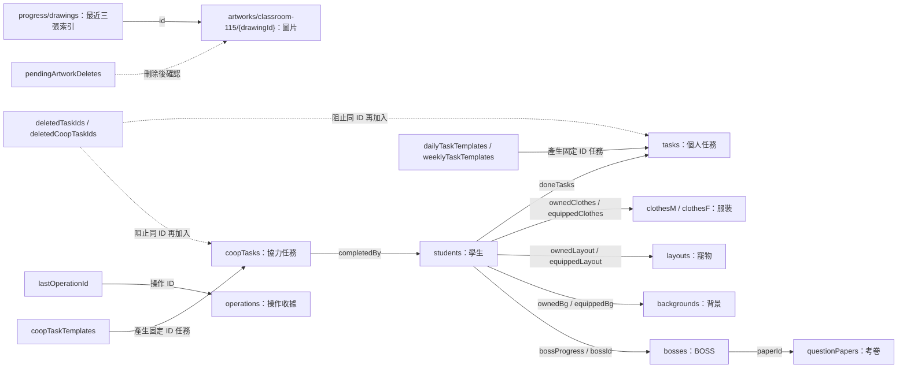

# 班級遊戲資料庫結構

本專案使用 **Firebase Realtime Database（RTDB）**，資料儲存為 JSON 樹。以下表格用來說明節點與欄位，並非 SQL 資料表。

全班共用路徑為 `/games/classroom-115`。`progress` 只保存一份最新遊戲進度；`operations` 保存已成功寫入操作的收據，供連線中斷後確認結果與避免重複執行。

## 實際節點

```text
games/
└── classroom-115/
    ├── progress/
    │   ├── students[]
    │   ├── tasks[]
    │   ├── clothesM[]
    │   ├── clothesF[]
    │   ├── layouts[]
    │   ├── backgrounds[]
    │   ├── bosses[]
    │   ├── dailyTaskTemplates[]
    │   ├── weeklyTaskTemplates[]
    │   ├── coopTaskTemplates[]
    │   ├── coopTasks[]
    │   ├── questionPapers[]
    │   ├── bosses[]
    │   ├── drawings[]              （最多 3 筆 metadata）
    │   ├── pendingArtworkDeletes[]
    │   ├── deletedTaskIds[]
    │   ├── deletedCoopTaskIds[]
    │   ├── globalBgImage
    │   └── lastSaved
    ├── operations/
    │   └── {operationId}/
    │       ├── id
    │       ├── uid
    │       ├── type
    │       ├── createdAt
    │       ├── committedAt
    │       └── result/
    │           └── json
    ├── lastOperationId
    └── restoredAt                  （初始化或還原後才有）
artworks/
└── classroom-115/
    └── {drawingId}/
        ├── id
        ├── savedAt
        └── data                    （JPEG／PNG Data URL）
```

`[]` 表示程式使用的陣列。RTDB 會以 `0`、`1`、`2` 等子節點保存元素；例如 `progress/students/0/id` 通常是 `1`。陣列位置與元素內的 `id` 是不同概念，操作依元素的 `id` 尋找資料。空陣列與 `null` 在 RTDB 可能不留下節點，讀入時會補成程式需要的空陣列或預設值。

| 班級根節點 | 型別 | 用途 |
| --- | --- | --- |
| `progress` | 物件 | 最新全班遊戲進度，至少有一位學生。 |
| `operations/{operationId}` | 物件 | 一筆已提交操作的固定收據，以操作 ID 為鍵；一般只保留最近一小時且位於最新 100 筆內的收據。 |
| `lastOperationId` | 字串 | 最近一次提交的操作 ID，對應 `operations` 中的收據。 |
| `restoredAt` | 數字，可省略 | 最近一次初始化或還原的伺服器時間，單位為 Unix 毫秒；用來取消還原前未確認的一般操作。 |

## 進度的集合與共用欄位

以下路徑均位於 `/games/classroom-115/progress`。

| 欄位 | 型別 | 內容 |
| --- | --- | --- |
| `students` | 學生陣列 | 每位學生的資源、已完成任務、衣櫃、寵物互動與個別 BOSS 進度。 |
| `tasks` | 任務陣列 | 一次性及已產生的每日、每週個人任務。 |
| `clothesM`、`clothesF` | 商品陣列 | 男生、女生服裝目錄。 |
| `layouts` | 商品陣列 | 寵物目錄；欄位沿用 `layout` 名稱。 |
| `backgrounds` | 商品陣列 | 可購買的角色背景目錄。 |
| `bosses` | BOSS 陣列 | 已發布的多隻 BOSS、題庫、生命值設定、獎勵與啟用狀態。舊版單一 `boss` 會在正規化後轉入此陣列。 |
| `dailyTaskTemplates`、`weeklyTaskTemplates` | 模板陣列 | 產生個人週期任務的設定。 |
| `coopTaskTemplates` | 模板陣列 | 產生每日或每週協力任務的設定。 |
| `coopTasks` | 協力任務陣列 | 怪獸、獎勵、完成成員與全班發獎狀態。 |
| `questionPapers` | 考卷陣列 | 可供多隻 BOSS 引用的獨立題庫與題目。 |
| `bosses` | BOSS 陣列 | BOSS 顯示、血量、雙資源獎勵、攻打密碼及所選考卷。 |
| `drawings` | 畫作索引陣列 | 最近三張作品的 `{id, savedAt}`，不含圖片。 |
| `pendingArtworkDeletes` | 畫作 ID 陣列 | 已移出最近三張、等待刪除外部圖片的 ID。 |
| `deletedTaskIds` | ID 陣列 | 已刪除個人任務的 ID，避免同 ID 任務再次加入。 |
| `deletedCoopTaskIds` | ID 陣列 | 已刪除協力任務的 ID，避免排程重新產生。 |
| `globalBgImage` | 字串 | 全站背景圖片；空字串代表未指定。 |
| `lastSaved` | ISO 8601 字串 | 最近一次實際寫入進度的時間，供畫面顯示；不作為決定誰可覆蓋資料的版本號。 |

新建商品與任務通常使用字串 ID；操作處理器也相容舊資料的數字 ID。刪除記錄保存同型別的 ID。`progress` 沒有版本清單，也沒有自動歷史進度備份。

## 學生：`students[]`

| 欄位 | 型別 | 意義與規則 |
| --- | --- | --- |
| `id` | 數字 | 學生編號；正常班級依 `1`、`2`、`3`…排列，編號不可重複。 |
| `gender` | `"M"`／`"F"` | 決定可購買、抽取與顯示的服裝目錄。 |
| `tokens` | 數字 | 目前代幣。加減操作以雲端最新餘額計算；教師也可明確覆蓋設定。 |
| `lotteryTickets` | 非負整數 | 目前樂透券，每次抽獎扣一張。 |
| `doneTasks` | 任務 ID 陣列 | 已完成的個人任務，對應 `tasks[].id`；同一任務只領一次獎勵。 |
| `petAffection` | 非負整數 | 寵物累積好感度。等級由 `floor(petAffection / 10) + 1` 計算，不另外存等級欄位。 |
| `lastPetMoodDate` | `YYYY-MM-DD` 字串或空字串 | 最近領取每日互動好感度的台灣日期；一天只增加一次。 |
| `ownedClothes` | 商品 ID 陣列 | 已擁有服裝，對應服裝目錄的 `id`。 |
| `equippedClothes` | 商品 ID 或 `null` | 目前穿著的服裝；`null` 使用預設角色。 |
| `ownedLayout` | 商品 ID 陣列 | 已擁有寵物，對應 `layouts[].id`。 |
| `equippedLayout` | 商品 ID 陣列 | 最多一個已裝備寵物；空陣列使用預設寵物。 |
| `ownedBg` | 商品 ID 陣列 | 已擁有背景，對應 `backgrounds[].id`。 |
| `equippedBg` | 商品 ID 或 `null` | 目前使用的角色背景。 |
| `bossProgress` | BOSS 進度陣列 | 該學生對各 BOSS 的個人剩餘血量、密碼驗證、答對題目、擊敗狀態與完成時間。 |

`bossProgress[]` 以 `bossId` 關聯 `bosses[].id`，並保存 `hp`、`passwordVerified`、`answeredQuestionIds`、`defeated` 與可省略的 `completedAt`。BOSS 血量及答題歷程在學生間互相獨立；擊敗後該學生不再看見該 BOSS。

衣櫃重置只清除該學生的持有與裝備欄位。全班資源重置會清除目前全體學生的代幣、樂透券及衣櫃，保留 `doneTasks`、`petAffection` 與 `lastPetMoodDate`。

## 商品：四種目錄共用結構

適用於 `clothesM[]`、`clothesF[]`、`layouts[]`、`backgrounds[]`。

| 欄位 | 型別 | 意義 |
| --- | --- | --- |
| `id` | ID | 商品識別碼，供衣櫃持有與裝備欄位參照。 |
| `name` | 字串 | 商品名稱。 |
| `level` | `"R"`／`"SR"`／`"SSR"`／`"UR"` | 稀有度與抽獎分組。 |
| `price` | 數字 | 實際購買價格，購買時讀取最新值。缺少價格時依稀有度補 `50`／`100`／`200`／`300`。 |
| `active` | 布林值 | `false` 代表下架，不可購買或抽中。 |
| `image` | 字串 | 圖片路徑或圖片 Data URL。 |

目錄陣列的順序就是商品排序。刪除目錄商品不會自動清除學生的持有 ID；重新開啟頁面也不會補回教師已刪除的內建商品。

## 個人任務與模板

| `tasks[]` 欄位 | 型別 | 意義 |
| --- | --- | --- |
| `id` | ID | 任務識別碼。 |
| `title` | 字串 | 任務名稱。 |
| `reward` | 數字 | 完成後獲得的代幣。 |
| `dueAt` | Unix 毫秒或 `null`，可省略 | 截止時間；未指定時沒有截止限制。 |
| `startAt` | Unix 毫秒，可省略 | 操作處理器相容的開始時間；若存在，尚未開始時不可完成。一般個人任務建立流程不填此欄位。 |
| `dailyTemplateId`、`dailyDate` | ID、日期字串，可省略 | 每日任務來源模板及台灣日期。 |
| `weeklyTemplateId`、`weeklyDate` | ID、日期字串，可省略 | 每週任務來源模板及該週星期一日期。 |

| 個人模板欄位 | 適用集合 | 型別與用途 |
| --- | --- | --- |
| `id`、`title`、`reward` | 每日、每週 | 模板 ID、任務名稱、代幣獎勵。 |
| `enabled` | 每日、每週 | 布林值；停用後不再產生新任務。 |
| `appearTime`、`dueTime` | 每日、每週 | `HH:mm`，預設 `08:00`、`23:59`。 |
| `appearWeekday`、`dueWeekday` | 每週 | `0` 至 `6`，星期日為 `0`；預設星期一、星期五。 |

排程以台灣時間計算日期、以星期一作為每週起點；截止不晚於開始時，順延一天或一週。同一週期使用固定 ID，例如 `daily_d_2026-09-15`、`weekly_w_2026-09-14`。產生前會檢查最新模板、現有任務與刪除記錄。

## 協力任務與模板

| `coopTasks[]` 欄位 | 型別 | 意義 |
| --- | --- | --- |
| `id` | ID | 協力任務識別碼。 |
| `monsterName`、`content` | 字串 | 怪獸名稱與任務內容。 |
| `monsterImage` | 字串 | 怪獸圖片路徑或 Data URL。 |
| `reward` | 數字 | 每位學生獲得的獎勵；樂透券獎勵必須是整數。 |
| `rewardType` | `"token"`／`"ticket"` | 代幣或樂透券。 |
| `completedBy` | 學生 ID 陣列 | 已完成成員，對應 `students[].id`，同一人不重複加入。 |
| `claimed` | 布林值 | 全班是否已領獎；依目前學生名單全部完成時，一次發給全班並設為 `true`。 |
| `startAt`、`dueAt` | Unix 毫秒或 `null` | 開始、截止時間。 |
| `coopTemplateId` | ID，可省略 | 週期協力任務的來源模板。 |

`coopTaskTemplates[]` 保存 `id`、`monsterName`、`content`、`monsterImage`、`reward`、`rewardType`，以及 `enabled`、`scheduleType`、`appearTime`、`dueTime`、`appearWeekday`、`dueWeekday`。`scheduleType` 是 `"daily"` 或 `"weekly"`；星期欄位只在每週排程使用。模板不保存完成名單或領獎狀態。

協力排程 ID 例如 `coop_daily_c_2026-09-15`、`coop_weekly_cw_2026-09-14`。刪除模板只停止日後產生任務，不刪除已產生的任務。

## BOSS 與題庫考卷

| `questionPapers[]` 欄位 | 型別 | 意義 |
| --- | --- | --- |
| `id` | ID | 考卷識別碼，供 `bosses[].paperId` 參照。 |
| `name` | 字串 | 老師後台顯示的考卷名稱。 |
| `questions` | 題目陣列 | 考卷內可新增、刪除的選擇題或是非題。 |

每題保存 `id`、`text`、`options` 與 `answerIndex`。`options` 必須有 2 或 4 個字串，`answerIndex` 是正確選項的零起始索引。刪除仍被 BOSS 使用的考卷會被前端阻止。

| `bosses[]` 欄位 | 型別 | 意義 |
| --- | --- | --- |
| `id`、`name`、`image` | ID、字串、字串 | BOSS 識別碼、名稱及圖片。 |
| `maxHp` | 正整數 | 每位學生開始攻打時的最大血量。 |
| `attackPassword` | 4 位數字字串 | 每位學生首次攻打該 BOSS 時驗證。 |
| `reward` | 非負整數 | 擊敗後發放的代幣。 |
| `rewardTickets` | 非負整數 | 擊敗後發放的樂透券。 |
| `paperId` | 考卷 ID | 指向 `questionPapers[].id`。 |
| `active` | 布林值 | `false` 時不可攻打。 |

尚未使用的題目優先隨機出題；全部題目答對過後，會從已答對題目繼續隨機出題。舊資料若把 `questions` 直接存在 BOSS 內，正規化時會建立 `legacy_paper_{bossId}` 相容考卷。`resetBossProgress` 操作會移除指定 BOSS 在全體學生的 `bossProgress`，因此血量回到最新 `maxHp`，並清除密碼驗證、答題及擊敗紀錄。

## 畫作與刪除記錄

| `progress/drawings[]` 欄位 | 型別 | 意義 |
| --- | --- | --- |
| `id` | 字串 | 畫作唯一 ID，對應 `/artworks/classroom-115/{drawingId}`。 |
| `savedAt` | ISO 8601 字串 | 使用者儲存作品的時間，用來排列最新三張。 |

| `/artworks/classroom-115/{drawingId}` 欄位 | 型別 | 意義 |
| --- | --- | --- |
| `id` | 字串 | 必須等於節點鍵，格式為 `drawing_` 加英數、底線或連字號。 |
| `savedAt` | ISO 8601 字串 | 與索引相同的儲存時間。 |
| `data` | 字串 | JPEG 或 PNG Data URL，上限 1,500,000 個字元。 |

儲存作品時先寫圖片，再以班級交易加入索引。第四張出現時，最舊 ID 加入 `pendingArtworkDeletes`；在線裝置刪除外部圖片成功後，再用 `confirmArtworkDeletion` 移除待辦。安全規則禁止刪除目前三筆索引仍引用的圖片。

一般同步只訂閱 `progress/drawings` 的三筆索引，因此不下載圖片。畫板開啟後才讀缺少的圖片；同一 ID 在該次頁面工作階段會使用記憶體快取。老師後台沒有畫冊或歷史畫作。

刪除個人任務時，會同時移除 `tasks` 中的任務、清除最新全班學生 `doneTasks` 內的同 ID，並加入 `deletedTaskIds`。刪除協力任務則更新 `coopTasks` 與 `deletedCoopTaskIds`。這些 ID 是防止任務重生的刪除記錄，不是已刪任務的內容備份。

## ID 關聯圖



上述關聯由程式依 ID 查找，不是資料庫外鍵。商品、模板或學生刪除後，部分既有任務或持有 ID 可以保留；各操作依最新名單與目錄驗證。

## 操作收據與共用中繼資料

| `operations/{operationId}` 欄位 | 型別 | 意義 |
| --- | --- | --- |
| `id` | 字串 | 與節點鍵相同的唯一操作 ID。重試沿用原 ID。 |
| `uid` | 字串 | 提交操作的 Firebase 登入 UID，目前使用匿名登入；不是學生編號。 |
| `type` | 字串 | 操作種類，例如 `completeTask`、`purchase`、`lottery`、`edit`、`restore`。 |
| `createdAt` | Unix 毫秒 | 操作建立時間，由裝置時間加 Firebase 伺服器時間差取得。 |
| `committedAt` | Unix 毫秒 | Firebase 在成功提交時填入的伺服器時間。 |
| `result.json` | 字串 | 操作結果經 `JSON.stringify` 後的內容，例如 `{"ok":true,"reward":20}`。讀取收據時以 `JSON.parse` 還原。 |

收據保存結果與基本操作資訊，不保存整份進度或完整命令。支援的操作包含初始化／還原、完成任務、購買、樂透、裝備、寵物互動、BOSS 攻擊、全員 BOSS 進度重置、協力完成、存畫作、確認畫作刪除、資源加減／設定、衣櫃重置、全班資源重置、人數／性別設定、教師欄位編輯及排程。

在遵循此操作協定的客戶端之間，相同操作 ID 仍存在時會直接讀回原結果，避免重複扣款或發獎。每筆新交易會移除超過一小時或超出最新 100 筆範圍的舊收據；執行交易之裝置仍在 `sessionStorage` 待確認佇列中的 ID 例外保留。這些收據不能用來還原完整歷史進度。沒有資料變更的操作直接回傳結果，不另外建立收據。

`lastOperationId` 是最新收據的指標，`restoredAt` 是最近還原的時間界線；它們都不是進度版本。新進度不保留舊有的 `syncVersion`、`revision`、`baseCommitId`、`commitId`、`updatedAt`。舊欄位會在首次實際成功寫入新進度時移除，啟動讀取與單純正規化不會回寫雲端。

## 如何讀取與更新

前景且連線中的頁面會分別訂閱 `progress` 的學生、任務、商品、協力任務、畫作索引與設定子路徑。首次開啟、切回頁面或恢復連線時取得各子路徑目前值，之後只接收實際變動的子路徑；不再每分鐘下載整份 `progress`。只有待確認操作需要另外查詢其收據，日常訂閱不下載操作收據集合。

實際操作在 `/games/classroom-115` 班級根節點使用 Firebase SDK `runTransaction()`：先取得最新班級資料，在最新進度上計算操作，再原子寫入新進度、操作收據與最新操作 ID。若其他裝置先寫入，SDK 會用最新資料重新計算。交易結果由本機交易快照取得，不再使用會回傳完整 `room` 的 REST ETag PUT。

每次成功交易會一併清除超過一小時或超出最新 100 筆範圍的舊收據。交易裝置 `sessionStorage` 中仍待確認的操作 ID 會優先保留，必要時可暫時超過一般上限。畫作訂閱只包含最多三筆 `{id, savedAt}` 索引，圖片仍依 ID 按需下載並使用頁面記憶體快取。

交易會保留讀到的其他班級根欄位與既有收據；新增或修改欄位仍須符合資料庫規則。教師欄位編輯只改指定欄位，同一欄位已被其他裝置改動時會拒絕，讓使用者依最新資料重試。

| 使用情境 | 更新結果 |
| --- | --- |
| 同一學生原有 100 代幣，兩台裝置分別完成獎勵 20、30 的任務 | 最新餘額為 150，兩個任務 ID 都加入 `doneTasks`。 |
| 原有 100 代幣，兩台裝置都購買同一件 50 代幣商品 | 只扣一次，持有 ID 只加入一次，餘額為 50。 |
| 最後兩位學生從不同裝置完成協力任務 | 完成名單累加，全員完成後只發獎一次。 |
| 網路中斷前抽獎已提交，裝置重試同一操作 ID | 讀取原收據，顯示原抽獎結果，不再消耗樂透券。 |
| 教師刪除今日排程任務 | 清除任務及學生完成記錄，保留刪除 ID；同日排程不會補回。 |
| 教師還原備份 | 取代最新 `progress`、更新 `restoredAt` 並新增還原收據；保留既有收據，較早未確認的一般操作取消。 |

教師下載備份時，會重新讀取最新 `progress`，再按索引取回最多三張完整圖片後輸出 JSON；備份檔不包含班級根節點的操作收據、共用中繼資料或刪除待辦。還原時只接受備份內最多三張有效完整圖片，並配置新的畫作 ID。

實作依據：[操作處理器](../public/game-operations.mjs)、[Firebase 儲存介面](../public/firebase-store.mjs)、[同步控制器](../public/cloud-sync.mjs)、[頁面與備份流程](../public/index.html)、[資料庫規則](../database.rules.json)。
